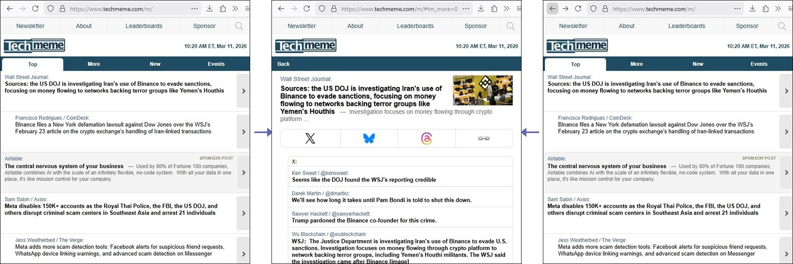

# Techmeme Back/Forward Fix

A Greasemonkey-compatible userscript for mobile browsers that makes the browser Back and Forward gestures work correctly with Techmeme’s in-page "more" overlays.

> **Latest Version**: 1.0.0 | [See What's New](CHANGELOG.md)

## Table of Contents
- [Problem](#problem)
- [Solution](#solution)
- [Requirements](#requirements)
- [Installation](#installation)
- [How it works (high level)](#how-it-works-high-level)
- [Limitations](#limitations)
- [Provenance](#provenance)
- [Licence](#licence)

## Problem

On Techmeme's mobile site, tapping the "more" link in a story opens an in-page overlay
using JavaScript without updating the URL. As a result:

- Browser Back does nothing
- You must tap Techmeme's small "Back" control instead
- Forward navigation is impossible

## Solution

This script:
- Pushes a history entry when a `nav_to_more` cell is tapped
- Uses a URL hash to represent the opened overlay
- Maps browser Back to Techmeme's `backFromPage`
- Maps browser Forward to reopening the same overlay

No page reloads. No interference with outbound article links.

## Requirements

- A web browser that allows UserScripts.
- https://www.tampermonkey.net/ (Chrome, Firefox, Edge, Safari, Opera)
- https://violentmonkey.github.io/ (Chrome, Firefox, Edge)
- 
## Installation

1. Install Violentmonkey or Tampermonkey from your browser's Add-Ons/Extensions page.
2. Open src/techmeme-improve-navigation.js in your browser
3. Your userscript manager should detect it and prompt you to install
4. Click "Install"

The script automatically runs on:
- `https://techmeme.com/*`
- `https://www.techmeme.com/*`

## How it works (high level)

- Intercepts taps on `td.nav_to_more` in capture phase
- Extracts the Techmeme item id from `openItemPage(...)`
- Calls `history.pushState()` with a hash
- Listens for `popstate` to close or reopen overlays

## Limitations

- Relies on Techmeme's current DOM structure and `openItemPage` API
- If Techmeme changes these, the script may need adjustment

## Provenance
This UserScript was authored by [Fanis Hatzidakis](https://github.com/fanis/techmeme-improve-navigation) with assistance from large-language-model tooling (ChatGPT and Claude Code). 
All code was reviewed, tested, and adapted by Fanis.

## Licence

Copyright (c) 2025 Fanis Hatzidakis

Licensed under PolyForm Internal Use License 1.0.0

See LICENCE.md